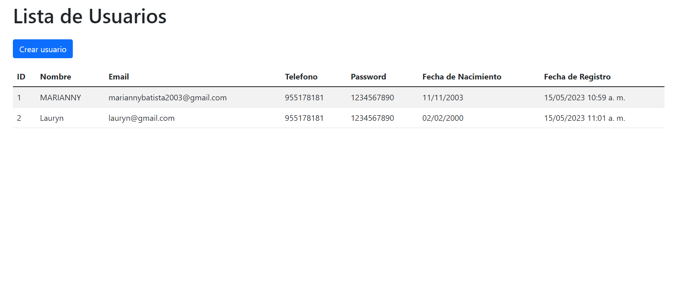
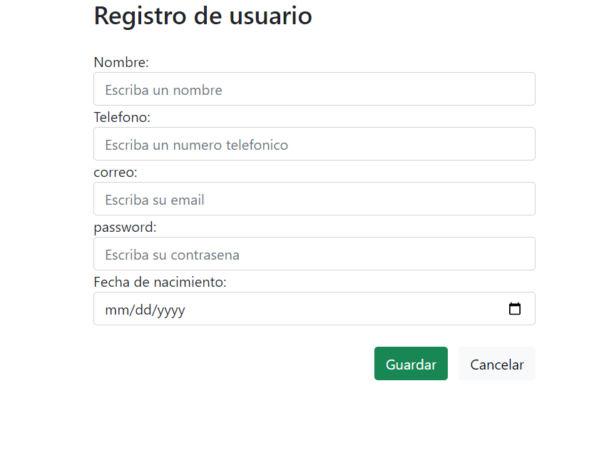
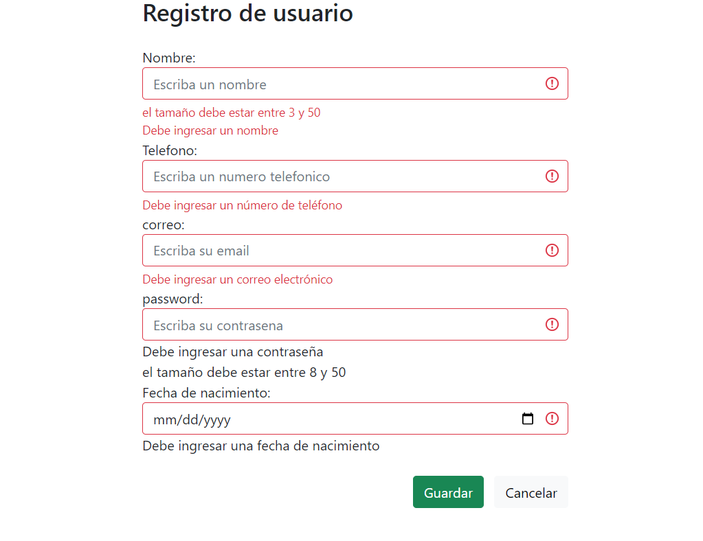

# CreacionUsuarios
Este proyecto se creó utilizando Java 20 y Spring Boot.

## Objetivo
La creacion de usuarios es importante para el registro de datos en cualquier entidad, por lo que esta aplicacion proporciona las ideas claves sobre el almacenamiento de datos y validaciones que tiene un programa de registro.

## Presentacion

El inicio de la aplicacion esta en la siguiente imagen:

Se puede observar la creacion de usuarios y una opcion de crear un nuevo usuario

Tendrás errores si no rellenas todos los campos

## Instalación
Asegúrate de tener Eclipse y MySQL Workbench instalados antes de descargar este proyecto.

### Eclipse:
- Descarga el proyecto en formato ZIP y descomprímelo.
- Abre Eclipse y selecciona un espacio de trabajo.
- Importa el proyecto en Eclipse como un proyecto existente en el sistema.

### MySQL Workbench:
- Abre MySQL Workbench y configura tus ajustes correspondientes.
- Crea una base de datos llamada "agenda_usuario" y ejecútala.
- Asegúrate de que la base de datos "agenda_usuario" esté abierta con los parámetros requeridos por el proyecto.
